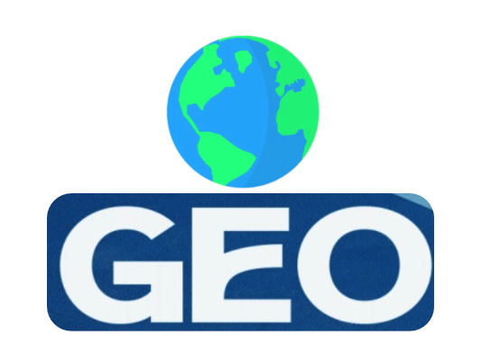

This is the updated version V.20
<p align="center">
  
</p>
<h1 align="center">Geo</h1>
<p align="center">
A fast Webbrowser


---

Contact : azadpelia13@gmail.com (if you run into errors or want to give feedback)

## What is Geo?

Geo is a lightweight desktop web browser. It has tabs, workspaces,
a settings panel, and a fun frosted-glass style. It's still being
built, so expect a few bugs here and there.

Most simple browser projects fake their tabs using something called
an `<iframe>`. The problem is that big sites like Google **block**
iframes on purpose, as a safety rule. So those fake browsers just
show an error instead of the real page.

Geo doesn't do that. Every tab in Geo is a **real, separate browser
window**, stacked right on top of the app — the same way Chrome or
Safari does it. That means real websites load the normal way and
nothing gets blocked.

## Features

- **Real tabs** — each one is its own native webview, not an iframe
- **Workspaces** — separate groups of tabs (e.g. Personal / Work),
  each with its own color, history, bookmarks, and saved logins
- **App & workspace lock screens** — an optional password gate for
  the whole app, plus an optional separate password per workspace
- **Encrypted local storage** — saved logins, bookmarks, and history
  are encrypted at rest (AES-256-GCM) with a key scoped to the
  active workspace; nothing is ever written to disk as plain JSON
- **Built-in ad & tracker blocking** — a local blocklist, no calling
  home to check it
- **Dark mode** — a filter-based dark mode that applies to every
  site, not just ones that ship their own
- **Command menu (⌘K)** — quick actions and navigation
- **Search suggestions** — optional, off automatically when privacy
  mode is on

## Why I made Geo

I wanted to build my own browser instead of just using one that
already exists. It's also a learning project that pulls together:

- Rust
- Tauri
- JavaScript
- HTML
- CSS
- Desktop app building
- Browser concepts

This project isn't finished yet, and I plan to keep improving it.

## What's inside this folder

```
Geo-BrowserV2/
├── README.md                   <- you are here
├── HOW-TO-RUN.txt               step-by-step instructions, no jargon
├── PRIVACY.txt                  what Geo stores and where
├── Start Geo (Mac or Linux).command
├── Start Geo (Windows).bat
└── app/                         the actual app code
    ├── package.json               tells npm how to start/build the app
    ├── src/                       everything you SEE (the UI)
    │   ├── index.html               the page layout: sidebar, tabs, toolbar
    │   ├── css/                     colors, spacing, the glass look
    │   │   ├── glass.css              the color/design rules
    │   │   └── app.css                everything else (layout, buttons, etc.)
    │   └── js/                      the logic that makes buttons do things
    │       ├── app.js                 tabs, workspaces, navigation, the ⌘K menu
    │       ├── settings.js            the settings screen
    │       ├── widgets.js             shared UI pieces (cards, layouts)
    │       ├── dialog.js              popup/dialog helper
    │       ├── lock.js                app lock & workspace lock screens
    │       ├── crypto.js              AES-256-GCM encrypt/decrypt helpers
    │       └── secure-store.js        hands out the right encryption key
    └── src-tauri/                 the Rust part that makes it a real
                                    desktop app, not just a webpage
        ├── src/main.rs                creates each tab as its own real
                                        window, ad/tracker blocklist, and
                                        the local password-lock storage
        ├── Cargo.toml                 Rust's version of package.json
        ├── build.rs                   a small setup script Rust runs first
        └── tauri.conf.json            app name, window size, icon settings
```

## Before you run it

You need two free programs installed first:

1. **Node.js** — https://nodejs.org (pick the LTS version)
2. **Rust** — https://rustup.rs

You only need to do this once. After that, check **HOW-TO-RUN.txt**
for the exact steps to start the app.

## Good to know

- The first time you run Geo, your computer has to download and
  build a bunch of Rust code. That can take a few minutes — it's
  normal, not stuck.
- If it complains about a missing icon, that just means the app icon
  files haven't been generated yet. HOW-TO-RUN.txt covers that too.
- Locking the app or a workspace is optional and fully local —
  nobody but you can see or reset that password. See PRIVACY.txt
  for details on what's stored and how.

## System requirements

| Operating System | Supported |
| ----------------- | --------- |
| macOS              | ✅ Yes     |
| Windows            | ✅ Yes     |
| Linux              | ✅ Yes     |

About 500 MB of free RAM is recommended.

## Status

Geo is early in development. You may run into bugs, crashes, or
missing features. If you find something broken, feel free to reach
out — feedback helps make it better.

**Thanks for checking out Geo.**
